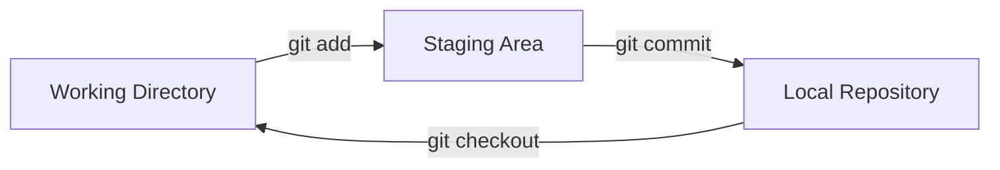

# Git с нуля: контроль версий для DevOps-инженера

> **📌 Навигация по курсу**
> 
> **Пререквизиты:** Урок 3 (Основы Bash)
> 
> **Следующий урок:** Урок 7 (Git Branching)
> 
> **Папка урока:** `lessons/level1/lesson06/`

## Жизнь без Git — и почему это боль

Представьте себе типичный рабочий день системного администратора или начинающего разработчика в эпоху «до Git». Вы правите конфигурационный файл Nginx или пишете скрипт для автоматизации бэкапов. Всё работает. Вы решаете добавить новую функцию, правите код... и всё ломается. 

Как вы поступите? Скорее всего, перед правками вы предусмотрительно сделали копию: `script.sh.bak`. А потом `script.sh.bak2`. А через неделю ваш рабочий стол превращается в кладбище файлов:
* `deploy_v1.sh`
* `deploy_v2.sh`
* `deploy_v2_final.sh`
* `deploy_v2_final_v2.sh`
* `deploy_v2_final_v2_FIXED_DONOTDELETE.zip`

Это — **ручной контроль версий**, и это путь к катастрофе. В такой системе невозможно понять:
1. **Что именно изменилось?** (Приходится сравнивать файлы глазами или через `diff`).
2. **Кто внес изменения?** (Если над проектом работают двое, файлы перетираются).
3. **Зачем это было сделано?** (Комментарии в коде — не замена истории изменений).
4. **Как вернуться к версии, которая работала во вторник в 14:00?**

Более того, представьте, что вы работаете в команде из пяти человек над одним набором конфигураций Kubernetes. Без системы контроля версий вам пришлось бы постоянно спрашивать в чате: «Кто сейчас правит deployment.yaml? Я могу его открыть?». Это убивает продуктивность.

**Git** был создан Линусом Торвальдсом в 2005 году именно для того, чтобы решить эти проблемы при разработке ядра Linux. Торвальдсу не нравились существующие решения (вроде BitKeeper или SVN), и он создал систему, которая работает быстро, надежно и распределенно.

Сегодня Git — это стандарт де-факто. Для DevOps-инженера Git — это не просто «хранилка для кода», это фундамент методологии **Infrastructure as Code (IaC)**. Без него невозможны CI/CD пайплайны, совместная работа над Terraform-модулями или Helm-чартами. Если вашего кода нет в Git — его не существует для автоматизации.

---

## Установка и первичная настройка Git

Прежде чем приступать к работе, Git нужно установить. В большинстве современных дистрибутивов Linux и macOS он уже есть, но лучше убедиться, что у вас актуальная версия.

### Установка на разные платформы

**1. Ubuntu/Debian (Linux):**
Используйте стандартный менеджер пакетов `apt`.
```bash
sudo apt update
sudo apt install -y git
```

**2. CentOS/RHEL/Fedora:**
```bash
sudo dnf install git  # Для новых версий
# или
sudo yum install git  # Для старых версий
```

**3. macOS:**
Самый простой способ — использовать Homebrew.
```bash
brew install git
```
Если Homebrew нет, Git предложит установиться при первом вводе команды `git` в терминале (через Xcode Command Line Tools).

**4. Windows:**
Для будущего DevOps-инженера на Windows есть два пути:
*   **Путь профи:** Установите **WSL2** (Windows Subsystem for Linux), выберите дистрибутив Ubuntu и устанавливайте Git там. Это позволит вам работать в полноценной Linux-среде.
*   **Классический путь:** Скачайте [Git for Windows](https://git-scm.com/download/win). Он установит «Git Bash» — эмулятор терминала, который понимает базовые команды Linux.

Проверьте установку командой:
```bash
git --version
```

### Первичная конфигурация: Представьтесь системе

Git должен знать, кто является автором изменений. Это критично для командной работы. Эти данные будут записываться в каждый ваш коммит (снимок состояния проекта) навсегда.

```bash
# Установка имени (используйте латиницу, имя и фамилию)
git config --global user.name "Ivan Ivanov"

# Установка почты (используйте ту же, что на GitHub/GitLab)
git config --global user.email "ivan@example.com"
```

**Разница между уровнями конфигов:**
*   `--system`: Настройки для всех пользователей ОС (файл в `/etc/gitconfig`).
*   `--global`: Настройки для вашего текущего пользователя (файл в `~/.gitconfig`).
*   `--local`: Настройки только для текущего репозитория (файл в `.git/config`).

Посмотреть все настройки и откуда они взялись:
```bash
git config --list --show-origin
```

---

## Основные концепции: области и состояния файлов

Многие новички совершают ошибку, пытаясь заучить команды без понимания архитектуры Git. Git — это не просто «облако», это система перемещения изменений между тремя логическими зонами.

### Три области Git (The Three Sections)

Для наглядности эти области можно представить в виде схемы:



1.  **Working Directory (Рабочая директория):** Это ваша папка с файлами на диске, которую вы видите в проводнике или VS Code. Здесь вы создаете, редактируете и удаляете код. Git «видит» изменения, но пока никак их не сохраняет в свою базу данных.
2.  **Staging Area (Index / Область индексации):** Это «прихожая» или черновик для следующего коммита. Это промежуточный файл (обычно в `.git/index`), который содержит информацию о том, что именно попадет в следующий «снимок». Вы можете изменить 10 файлов, но в индекс добавить только 2 из них.
3.  **Repository (Репозиторий / .git directory):** Это святая святых. Здесь хранятся все зафиксированные версии (коммиты) в сжатом виде. Когда вы делаете коммит, Git берет всё из Staging Area и навсегда сохраняет это в базу данных.

### Жизненный цикл файла (The Lifecycle)

Файл в Git может находиться в одном из четырех основных состояний:

1.  **Untracked (Неотслеживаемый):** Вы только что создали новый файл. Git видит его наличие, но говорит: «Я не слежу за этим файлом, он не в моей базе».
2.  **Unmodified (Неизмененный):** Вы только что сделали коммит или склонировали проект. Файлы в рабочей директории полностью совпадают с тем, что сохранено в репозитории.
3.  **Modified (Изменен):** Вы внесли правки в файл, который уже отслеживается Git. Git заметил разницу, но вы еще не подтвердили, что хотите сохранить эти правки.
4.  **Staged (Индексирован):** Вы отметили измененный файл как «готовый к коммиту».

---

## Твой первый репозиторий: от `init` до `commit`

Давайте пройдем полный цикл создания проекта с точки зрения DevOps-инженера.

### 1. Инициализация проекта (`git init`)
Представим, что мы начинаем писать скрипты для настройки сервера.

```bash
mkdir my-server-configs
cd my-server-configs
git init
```
Также можно инициализировать проект и создать папку одновременно: `git init my-project`. В этом случае Git создаст директорию `my-project` и выполнит в ней `init`.

После этой команды в папке появится скрытая директория `.git`. В ней хранится вся история вашего проекта. Если вы удалите эту папку, вы удалите всю историю версий, оставив только текущие файлы.

### 2. Проверка состояния (`git status`)
Это ваша самая часто используемая команда. Если вы не знаете, что делать дальше — пишите `git status`.

```bash
git status
```
Она подскажет, на какой вы ветке и какие файлы были изменены.

### 3. Подготовка изменений (`git add`)
Создадим первый файл:
```bash
echo "Server Name: Production-01" > server.info
```
Теперь `git status` покажет файл как **Untracked**. Чтобы Git начал его отслеживать и добавил в «черновик» коммита:
```bash
git add server.info
```

**Тонкости `git add`:**
*   `git add .` — добавить всё текущее дерево. Быстро, но часто приводит к попаданию мусора в репозиторий.
*   `git add *.sh` — добавить только скрипты.
*   `git add -p` (patch mode) — **высший пилотаж**. Git будет показывать вам каждый измененный кусок кода и спрашивать: «Добавить это в коммит?». Это позволяет разделять разные правки в одном файле на несколько логических коммитов.

### 4. Фиксация изменений (`git commit`)
Коммит — это элементарная единица истории. Каждый коммит имеет автора, дату, сообщение и уникальный SHA-1 хеш (например, `f7a2b3c...`). Хеш SHA-1 гарантирует целостность данных — вы не можете изменить содержимое файлов или историю незаметно для системы.

```bash
git commit -m "initial: add server info file"
```

> **Важно про сообщения коммитов:**
> Хорошее сообщение объясняет **ЗАЧЕМ** сделано изменение, а не **ЧТО** сделано (что сделано, видно в коде). 
> Плохо: `git commit -m "fix"`
> Хорошо: `git commit -m "fix(nginx): increase client_max_body_size to 100M for large uploads"`

### 5. Изучение истории (`git log`)
Чтобы увидеть список всех изменений:
```bash
git log
```
Для DevOps-инженера полезнее более компактный вид:
```bash
git log --oneline --graph --decorate --all
```
Это покажет красивое дерево коммитов прямо в терминале.

---

## Анализ различий (`git diff`)

Представьте, что вы изменили конфигурацию базы данных, но забыли, что именно поправили за последние полчаса.

*   `git diff`: Показывает разницу между вашей рабочей директорией и индексом (Staging Area). То есть то, что вы изменили, но еще не добавили через `git add`.
*   `git diff --staged`: Показывает разницу между индексом и последним коммитом. То есть то, что вы УЖЕ добавили в индекс и что попадет в следующий коммит.

Умение читать вывод `diff` (где красные строки со знаком `-` — удаленные, а зеленые с `+` — добавленные) — базовый навык при отладке проблем.

---

## Работа с удаленными репозиториями

Локальная работа — это только половина дела. Настоящая мощь Git проявляется при работе с серверами (GitHub, GitLab, самописный Gitea).

### Клонирование (`git clone`)
Если ваша команда уже начала проект, вы не создаете его заново, а копируете:
```bash
git clone https://github.com/company/infra-as-code.git
```
Git создаст папку, инициализирует репозиторий и скачает всю историю.

### Удаленные репозитории (`git remote`)
Git может работать с несколькими серверами одновременно. По умолчанию сервер, с которого вы клонировали, называется `origin`.

```bash
git remote -v  # Посмотреть список удаленных серверов
```

### Отправка и получение изменений (`push` & `pull`)

*   **`git push`**: Отправляет ваши локальные коммиты на сервер.
    ```bash
    git push origin main
    ```
*   **`git pull`**: Это комбинация двух команд: `fetch` (скачать данные с сервера) и `merge` (объединить их с вашим кодом). Используйте её в начале рабочего дня, чтобы получить правки коллег.
    ```bash
    git pull origin main
    ```

> **Опасность `--force`:** Команда `git push --force` принудительно перезаписывает историю на сервере. Если ваш коллега сделал коммит, а вы сделали `push --force`, его работа исчезнет. В DevOps это может привести к тому, что продакшн откатится на старую версию конфигурации. Используйте только в своих личных ветках!

---

## Безопасность и SSH-ключи

Работать через HTTPS (с вводом логина и пароля) неудобно и небезопасно. GitHub давно требует использовать персональные токены вместо паролей. Лучший выход — SSH-ключи.

**Алгоритм настройки:**
1.  **Создаем пару ключей** (отмычка и замок):
    ```bash
    ssh-keygen -t ed25519 -C "your_email@example.com"
    ```
    Используйте алгоритм `ed25519` — он быстрее и безопаснее старого RSA.
2.  **Запускаем ssh-agent** (чтобы не вводить парольную фразу ключа постоянно):
    ```bash
    eval "$(ssh-agent -s)"
    ssh-add ~/.ssh/id_ed25519
    ```
    *Примечание: Команды выше предназначены для Linux, macOS, Git Bash или WSL. Если вы используете стандартный PowerShell, вам может потребоваться сначала запустить службу: `Start-Service ssh-agent`.*
3.  **Копируем публичный ключ**:
    ```bash
    cat ~/.ssh/id_ed25519.pub
    ```
4.  **Добавляем в GitHub/GitLab**:
    Settings -> SSH and GPG keys -> New SSH Key. Вставьте скопированный текст (начинается с `ssh-ed25519...`).

Теперь вы можете клонировать репозитории через SSH-адрес: `git@github.com:user/repo.git`.

---

## .gitignore — Что не должно быть в Git

Одна из главных ошибок новичка в DevOps — закоммитить файл `.env` с паролем от базы данных или папку `node_modules` весом в 500 МБ.

Для фильтрации файлов используется файл `.gitignore`. Git просто игнорирует файлы, подходящие под шаблоны в нем.

**Пример правильного `.gitignore` для DevOps:**
```text
# Секреты и ключи (КРИТИЧЕСКИ ВАЖНО)
.env
*.pem
credentials.json

# Логи и временные файлы
*.log
tmp/
.cache/

# Специфично для ОС
.DS_Store
Thumbs.db

# Инструменты разработки
.vscode/
.idea/

# Папки зависимостей
node_modules/
vendor/
.terraform/
```

**Что делать, если файл уже попал в Git, а вы хотите его игнорировать?**
Просто добавить в `.gitignore` недостаточно, файл уже в базе. Его нужно удалить из индекса:
```bash
git rm --cached filename
```

---

## Шпаргалка по базовым командам (Cheat Sheet)

| Группа | Команда | Описание |
| :--- | :--- | :--- |
| **Старт** | `git init` | Создать новый репозиторий |
| | `git clone <url>` | Скопировать проект с сервера |
| **Работа** | `git status` | Понять, что происходит |
| | `git add <file>` | Подготовить файл к сохранению |
| | `git commit -m "msg"` | Сохранить изменения навсегда |
| **Анализ** | `git log --oneline` | Увидеть список последних коммитов |
| | `git diff` | Посмотреть изменения в коде |
| | `git show <hash>` | Посмотреть изменения в конкретном коммите |
| **Обмен** | `git pull` | Забрать чужое |
| | `git push` | Отдать своё |
| | `git remote -v` | Посмотреть адреса серверов |
| **Отмена** | `git checkout -- <file>` | Откатить изменения в файле до последнего коммита |
| | `git restore <file>` | Современная альтернатива `git checkout` для отмены изменений |
| | `git reset HEAD <file>` | Убрать файл из индекса (но оставить правки) |

---

## Типичные антипаттерны в Git

Чтобы коллеги вас уважали, избегайте этих ошибок:

1.  **Огромные коммиты («Monster Commits»):** Вы изменили 50 файлов, поправили 5 разных багов и обновили документацию в одном коммите. Если один из багов окажется критичным, откатить его отдельно будет невозможно. Делайте **атомарные коммиты**.
2.  **Коммиты без смысла:** Сообщения типа «fixed», «.», «update» бесполезны при расследовании инцидентов через полгода.
3.  **Хранение бинарных файлов:** Git плохо справляется с картинками, видео или скомпилированными `.exe` файлами. Репозиторий начинает «пухнуть» и тормозить. Используйте Git LFS для больших файлов.
4.  **Секреты в коде:** Пароль в Git — это не просто пароль в файле, это пароль во всей истории версий. Даже если вы удалите его следующим коммитом, он останется в истории. Придется перевыпускать все ключи или использовать инструменты вроде `bfg-repo-cleaner`.

---

## Заключение

Git — это как езда на велосипеде: сначала вы постоянно падаете и путаете педали (команды), но со временем это становится автоматическим навыком. Для DevOps-инженера знание Git на уровне «черного пояса» — это залог успешной карьеры. 

В этой статье мы разобрали фундамент: как создать проект, как фиксировать изменения и как обмениваться ими с миром. В следующем уроке мы перейдем к более сложным, но жизненно важным темам: **ветвлению и слиянию**. Мы узнаем, как работать над двумя задачами одновременно и что делать, если два человека изменили одну и ту же строку кода (конфликты слияния).

**Домашнее задание:**
1. Создайте аккаунт на GitHub.
2. Настройте SSH-ключ.
3. Создайте репозиторий `devops-practice`.
4. Сделайте первый коммит с файлом `README.md`.
5. Отправьте изменения в облако (`push`).

Удачи в консоли!

---

## Ключевые выводы урока

1.  **Git — фундамент IaC:** без контроля версий невозможны CI/CD, совместная работа над Terraform и автоматизация.
2.  **Три области Git:** Working Directory (рабочие файлы) → Staging Area (индекс) → Repository (история коммитов).
3.  **Четыре состояния файла:** Untracked (новый) → Unmodified (без изменений) → Modified (изменён) → Staged (готов к коммиту).
4.  **Атомарные коммиты:** один коммит = одна логическая правка; избегайте «монстр-коммитов» на 50 файлов.
5.  **Сообщение коммита объясняет ЗАЧЕМ:** «fix(nginx): increase client_max_body_size to 100M for large uploads» вместо «fix».
6.  **SSH-ключи вместо пароля:** используйте `ed25519`, добавляйте в GitHub/GitLab для безопасной работы.
7.  **`.gitignore` защищает от ошибок:** секреты (`.env`, `*.pem`), логи, `node_modules`, `.terraform/` не должны попадать в репозиторий.
8.  **`git status` — первая команда:** если не знаете, что делать — запустите `git status`.

---

## Глоссарий терминов урока

| Термин | Расшифровка | Простое объяснение |
|--------|-------------|-------------------|
| **Git** | — | Распределённая система контроля версий, созданная Линусом Торвальдсом в 2005 году. |
| **IaC** | Infrastructure as Code | Подход, при котором инфраструктура (серверы, сети) описывается кодом и хранится в Git. |
| **Repository** | Репозиторий | База данных Git, хранящая всю историю изменений проекта (папка `.git`). |
| **Working Directory** | Рабочая директория | Папка с файлами на диске, где вы редактируете код. |
| **Staging Area** | Область индексации | Промежуточная зона («черновик»), куда файлы добавляются перед коммитом. |
| **Commit** | Коммит | «Снимок» состояния проекта в определённый момент (имеет автора, дату, сообщение, хеш). |
| **SHA-1** | Secure Hash Algorithm 1 | 40-символьный хеш, уникально идентифицирующий каждый коммит (гарантирует целостность). |
| **Untracked** | Неотслеживаемый | Новый файл, о котором Git ещё не знает. |
| **Staged** | Индексированный | Файл, добавленный в индекс и готовый к следующему коммиту. |
| **Clone** | Клонирование | Полное копирование репозитория с сервера со всей историей. |
| **Origin** | — | Имя удалённого репозитория по умолчанию (сервер, с которого клонировали). |
| **Push** | Отправка | Передача локальных коммитов на удалённый сервер. |
| **Pull** | Получение | Скачивание изменений с сервера и объединение с локальным кодом (`fetch` + `merge`). |
| **SSH-key** | Secure Shell Key | Пара ключей (приватный и публичный) для безопасного подключения к серверам. |
| **ed25519** | — | Современный алгоритм шифрования для SSH-ключей (быстрее и безопаснее RSA). |
| **LFS** | Large File Storage | Расширение Git для хранения больших файлов (картинки, видео, бинарники). |
| **Patch mode** | Режим патча | Интерактивный режим `git add -p`, позволяющий добавлять в коммит отдельные куски кода. |

---

## Чек-лист готовности урока

- [ ] Объяснить разницу между Working Directory, Staging Area и Repository.
- [ ] Назвать 4 состояния файла в Git (Untracked, Unmodified, Modified, Staged).
- [ ] Инициализировать репозиторий через `git init`.
- [ ] Добавить файл в индекс через `git add`.
- [ ] Сделать коммит с осмысленным сообщением через `git commit -m`.
- [ ] Просмотреть историю коммитов через `git log --oneline --graph`.
- [ ] Увидеть изменения в файле через `git diff`.
- [ ] Клонировать репозиторий с GitHub через `git clone`.
- [ ] Добавить удалённый репозиторий через `git remote add`.
- [ ] Отправить изменения на сервер через `git push origin main`.
- [ ] Получить изменения с сервера через `git pull origin main`.
- [ ] Сгенерировать SSH-ключ через `ssh-keygen -t ed25519`.
- [ ] Добавить SSH-ключ в GitHub/GitLab.
- [ ] Создать `.gitignore` с правилами для секретов, логов и зависимостей.
- [ ] Удалить файл из индекса Git (но оставить на диске) через `git rm --cached`.
- [ ] Объяснить, почему нельзя коммитить `.env` с паролями.
- [ ] Объяснить опасность `git push --force`.
- [ ] Назвать 3 антипаттерна работы с Git (монстр-коммиты, бессмысленные сообщения, секреты в коде).

---

*Автор: @tech_writer для DevOps Level 1*
*Урок 6 из 15*

#git #vcs #beginner #github #version-control
