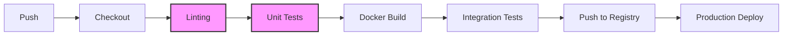

# CI/CD с нуля: автоматизируем сборку и деплой

> **📌 Навигация по курсу**
> 
> **Пререквизиты:** Урок 6 (Git), Урок 13 (Docker), Урок 14 (Dockerfile)
> 
> **Следующий уровень:** Level 2 — Intermediate
> 
> **Папка урока:** `lessons/level1/lesson15/`

## Введение: Кошмар «работает у меня» и цена ручного труда

Представьте типичное утро в динамично развивающемся стартапе. Разработчик Вася всю ночь работал над новой критически важной фичей. В 8 утра, выпив пятую чашку кофе, он торжественно объявляет в Slack: «Ребята, готово! У меня на ноутбуке всё летает». Вася пушит код в репозиторий и уходит спать. 

Через час просыпается системный администратор Петя. Ему нужно «выкатить» Васино творение на сервер. Петя заходит на сервер по SSH, делает `git pull`, пытается запустить приложение и... получает бесконечный список ошибок. Оказывается, Вася обновил версию Python до 3.12, установил три новые библиотеки, о которых забыл упомянуть в `requirements.txt`, и изменил структуру конфигурационного файла. 

Петя начинает «гадать», чего не хватает. Он тратит два часа на ручную установку зависимостей, правку конфигов и перезапуск сервисов. Наконец, приложение запускается, но через 10 минут пользователи начинают жаловаться: «Корзина не работает!». Оказывается, Вася случайно зацепил код обработки платежей, а тесты он запускал только «глазами» на главной странице.

**Это классическая проблема ручного деплоя (Manual Deployment).** В ней кроются четыре всадника апокалипсиса современной разработки:

1.  **Проблема окружения («Works on my machine»):** Ноутбук разработчика — это не сервер. Разные операционные системы, версии компиляторов, системные зависимости и переменные окружения превращают каждый деплой в лотерею.
2.  **Человеческий фактор:** Даже самый опытный администратор может опечататься. Лишний пробел в конфиге, забытая команда `database migration` или случайное `rm -rf /` вместо `rm -rf ./` — ошибки неизбежны, когда процесс не автоматизирован.
3.  **Отсутствие повторяемости:** Если Петя решит уволиться, процесс деплоя превратится в «черную магию». Никто не будет знать точную последовательность команд, которую он вводил в терминале.
4.  **Низкая скорость (Time-to-Market):** Пока код ждет, когда у Пети появится свободное окно для деплоя, бизнес теряет деньги. В современном мире побеждает тот, кто доставляет фичи быстрее конкурентов.

Решение этих проблем — **CI/CD**. Это не просто набор инструментов, это философия и методология автоматизации, которая превращает хаотичный процесс доставки кода в отлаженный конвейер.

---

## Что такое CI, CD и CD (Delivery vs Deployment)

Аббревиатура CI/CD часто вызывает путаницу, потому что за второй частью «CD» скрываются две разные концепции. Давайте разберем эту иерархию автоматизации по порядку.

### Continuous Integration (Непрерывная интеграция)
Это фундамент. CI — это практика, при которой разработчики сливают свои изменения в основную ветку (`main` или `master`) как можно чаще — несколько раз в день. 

**Как это работает:** Каждый раз, когда вы делаете `git push`, специальный сервер (CI-сервер) автоматически «подхватывает» ваш код, собирает его и запускает набор тестов. 
**Цель:** Как можно раньше обнаружить конфликты. Если два разработчика изменили один и тот же модуль несовместимым образом, CI сообщит об этом через пару минут. Исправить ошибку «по горячим следам» в сто раз дешевле, чем разгребать завалы кода через две недели перед релизом.

### Continuous Delivery (Непрерывная доставка)
Это логическое продолжение CI. На этом этапе мы автоматизируем не только тестирование, но и подготовку релиза.
**Суть:** После успешного прохождения всех тестов система автоматически создает «артефакт» — готовую к работе версию приложения. Это может быть Docker-образ, исполняемый файл или архив с кодом. Этот артефакт отправляется в хранилище (Registry).
**Ключевой момент:** В Continuous Delivery деплой на «живые» сервера (Production) происходит **вручную**. Человек (менеджер или лид) нажимает кнопку «Deploy to Prod», когда бизнес к этому готов. Это идеальный вариант для компаний с жесткими маркетинговыми циклами или там, где требуется финальная проверка «глазами».

### Continuous Deployment (Непрерывное развертывание)
Это высшая точка эволюции. Здесь человек полностью исключается из процесса доставки. 
**Суть:** Если код прошел все проверки, линтеры и тесты, он **автоматически** попадает к пользователям. От момента нажатия `Enter` в терминале разработчика до появления фичи на сайте проходит всего 5–10 минут.
**Условие:** Для этого нужна железная уверенность в качестве автотестов. Если ваш тестовый набор покрывает только 10% кода, непрерывное развертывание станет непрерывным потоком багов на продакшне.

**Сравнительная таблица процессов:**

| Этап | CI | Continuous Delivery | Continuous Deployment |
| :--- | :---: | :---: | :---: |
| **Сборка кода (Build)** | Автоматически | Автоматически | Автоматически |
| **Юнит-тесты (Unit Tests)** | Автоматически | Автоматически | Автоматически |
| **Создание артефакта** | ❌ | Автоматически | Автоматически |
| **Деплой в Staging (тестовый контур)** | ❌ | Автоматически | Автоматически |
| **Деплой в Production** | ❌ | **Вручную (одной кнопкой)** | **Автоматически** |

---

## Пайплайн — конвейер от кода до продакшна

В мире DevOps мы называем процесс автоматизации **пайплайном** (Pipeline) или «конвейер». Как на заводе Ford детали превращаются в автомобиль, проходя через цепочку постов, так и ваш код проходит через этапы пайплайна.

Давайте разберем типичную анатомию современного конвейера:

1.  **Trigger (Триггер):** Событие, которое запускает машину. Чаще всего это `push` в ветку `main` или создание Pull Request.
2.  **Checkout:** CI-система скачивает свежую копию кода из репозитория на виртуальную машину (**Runner**). GitHub предоставляет такие машины бесплатно для публичных проектов.
3.  **Linting & Static Analysis (Линтинг):** Проверка «чистоты» кода. Линтер проверяет, соблюдаете ли вы стандарты (например, **PEP8** — официальный стандарт оформления кода в Python), нет ли у вас неиспользуемых переменных или потенциальных дыр в безопасности. Если код «грязный», пайплайн останавливается.
4.  **Unit Testing:** Запуск быстрых, изолированных тестов. Они проверяют работу отдельных функций. Если 1+1 вдруг стало равно 3, мы узнаем об этом здесь.
5.  **Build (Сборка):** Самый ответственный момент. Мы упаковываем приложение. В 2024 году это почти всегда создание Docker-образа (`docker build`). Это гарантирует, что приложение будет работать везде одинаково.
6.  **Integration Testing:** Более сложные тесты. Мы запускаем наше приложение в контейнере, «поднимаем» рядом временную базу данных и проверяем, как они общаются.
7.  **Push to Registry:** Готовый и проверенный Docker-образ отправляется в облачное хранилище (Docker Hub, GitHub Container Registry).
8.  **Deploy:** Команда серверу «скачай новый образ и перезапусти контейнеры».

**Пример визуализации пайплайна (Mermaid):**


---

## GitHub Actions: ваш первый конвейер

Теперь перейдем от теории к практике. Почему мы выбираем **GitHub Actions**?
*   Это **бесплатно** для публичных репозиториев (и имеет щедрый лимит для приватных).
*   Это **встроено** в GitHub — не нужно устанавливать свои сервера (как в случае с Jenkins).
*   Это **огромное сообщество** — для 99% ваших задач уже кто-то написал готовый «Action».

### Основные понятия GitHub Actions

Прежде чем писать код, нужно выучить четыре слова:

1.  **Workflow (Воркфлоу):** Общий сценарий автоматизации. Это YAML-файл, который лежит в папке `.github/workflows/`. В одном репозитории может быть много воркфлоу (один для тестов, другой для деплоя, третий для поздравления коллег с Днем рождения).
2.  **Event (Событие):** Ответ на вопрос «Когда запускать?». Например: `on: push`.
3.  **Jobs (Работы/Джобы):** Набор шагов, которые выполняются на одном сервере. По умолчанию джобы выполняются параллельно, но их можно связать зависимостями.
4.  **Steps (Шаги):** Конкретные команды. Например: «Установи Python», «Запусти тесты». Шаги могут быть либо обычными bash-командами (`run: ...`), либо готовыми блоками (`uses: ...`).

> **💡 Про-тип: Шпаргалка по YAML**
> GitHub Actions использует формат YAML для конфигурации. Он очень строгий к оформлению:
> *   **Только пробелы:** Никогда не используйте клавишу Tab, только пробелы (обычно 2 или 4).
> *   **Иерархия через отступы:** Если один блок находится «внутри» другого, он должен иметь больший отступ.
> *   **Ключ: Значение:** Основной формат записи (`name: My Workflow`). После двоеточия обязательно должен быть пробел.
> *   **Списки:** Начинаются с дефиса `-`. Например, список веток:
>     ```yaml
>     branches:
>       - main
>       - develop
>     ```

---

## Практическое руководство: От кода до Docker Hub

Давайте создадим полноценный пайплайн для Python-приложения. Наша цель: при каждом пуше проверять код линтером, запускать тесты и, если всё хорошо, собирать Docker-образ и отправлять его на Docker Hub.

### Шаг 0: Подготовка Dockerfile
Убедитесь, что в корне вашего проекта есть `Dockerfile`. Мы учились его писать в предыдущем уроке. Для Python он может выглядеть так:

```dockerfile
FROM python:3.10-slim
WORKDIR /app
COPY requirements.txt .
RUN pip install --no-cache-dir -r requirements.txt
COPY . .
CMD ["python", "app.py"]
```

### Шаг 1: Создаем файл воркфлоу
В корне вашего проекта создайте директории `.github` и внутри неё `workflows`. Создайте там файл `main.yml`.

### Шаг 2: Пишем YAML-конфигурацию

```yaml
name: CI/CD Pipeline # Имя, которое вы увидите в интерфейсе GitHub

on:
  push:
    branches: [ "main" ] # Запускать только при пуше в основную ветку
  pull_request:
    branches: [ "main" ] # И при создании PR

jobs:
  # Первая джоба: Тестирование
  test:
    runs-on: ubuntu-latest # На какой ОС запускать (GitHub дает бесплатную Ubuntu)
    steps:
      - name: Checkout code
        uses: actions/checkout@v4 # Копируем наш код на Runner

      - name: Set up Python
        uses: actions/setup-python@v5
        with:
          python-version: '3.10'
          cache: 'pip' # Магия: кэшируем зависимости для скорости!

      - name: Install dependencies
        run: |
          python -m pip install --upgrade pip
          pip install flake8 pytest
          if [ -f requirements.txt ]; then pip install -r requirements.txt; fi

      - name: Lint with flake8
        run: |
          # Останавливаем билд, если есть синтаксические ошибки или неопределенные имена
          flake8 . --count --select=E9,F63,F7,F82 --show-source --statistics

      - name: Run tests
        run: |
          pytest

  # Вторая джоба: Сборка и отправка в Docker Hub
  build-and-push:
    needs: test # ВАЖНО: запускать только если тесты (джоба test) прошли успешно
    if: github.event_name == 'push' # Не пушим образы при создании Pull Request, только при слиянии
    runs-on: ubuntu-latest
    steps:
      - name: Checkout code
        uses: actions/checkout@v4

      - name: Log in to Docker Hub
        uses: docker/login-action@v3
        with:
          username: ${{ secrets.DOCKER_USERNAME }} # Используем секреты!
          password: ${{ secrets.DOCKER_PASSWORD }}

      - name: Build and push
        uses: docker/build-push-action@v5
        with:
          context: .
          push: true
          tags: |
            ${{ secrets.DOCKER_USERNAME }}/myapp:latest
            ${{ secrets.DOCKER_USERNAME }}/myapp:${{ github.sha }} 
            # Добавляем тег с хэшем коммита для версионности
```

### Разбор полетов: Почему это работает?

*   **`needs: test`**: Это критическая настройка. Она создает логическую связь. Если тесты упали, вторая джоба даже не запустится. Это и есть «защита от дурака».
*   **`actions/checkout@v4`**: Это готовый экшен от самого GitHub. Он делает `git clone` вашего кода во временную папку на сервере.
*   **Оптимизация (Cache)**: Мы добавили `cache: 'pip'`. Без этого GitHub каждый раз скачивал бы все библиотеки заново. С кэшем время работы пайплайна сокращается в 2–3 раза.
*   **Версионность**: Мы используем `${{ github.sha }}`. Это уникальный 40-символьный идентификатор (хэш) конкретного коммита. Теперь в Docker Hub у вас будет не только один `latest` (который постоянно перезаписывается), но и история всех версий. Если новый деплой сломает продакшн, вы сможете мгновенно «откатиться» на предыдущий хэш.

---

## Секреты и переменные окружения

Вы наверняка заметили странную запись `${{ secrets.DOCKER_USERNAME }}`. 

**Золотое правило безопасности №1:** Никогда, ни при каких обстоятельствах не пишите пароли прямо в коде или в YAML-файлах.

Даже если ваш репозиторий приватный, это опасно. Пароли попадают в историю Git, их видят все коллеги, а при взломе одного аккаунта злоумышленник получает ключи от всей инфраструктуры.

### Как работают GitHub Secrets?
GitHub позволяет хранить зашифрованные переменные на уровне репозитория.

1.  Зайдите в свой проект на GitHub.
2.  Перейдите в **Settings** -> **Secrets and variables** -> **Actions**.
3.  Нажмите **New repository secret**.
4.  Имя: `DOCKER_USERNAME`, Значение: ваше имя на Docker Hub.
5.  Имя: `DOCKER_PASSWORD`, Значение: ваш пароль (а лучше Access Token) от Docker Hub.

**Что происходит внутри?** GitHub шифрует эти данные с помощью мощного алгоритма. Когда пайплайн запускается, GitHub «подставляет» значения в переменные окружения. При этом в логах выполнения вместо пароля вы всегда будете видеть три звездочки `***`. Даже если вы случайно напишете `run: echo ${{ secrets.DOCKER_PASSWORD }}`, GitHub вырежет это значение из вывода.

---

## Результат: что умеет ваш первый пайплайн

После того как вы создадите файл и сделаете `git push`, перейдите на вкладку **Actions** в интерфейсе GitHub. Там вы увидите магию в действии.

1.  **Прозрачность:** Вы видите каждый шаг. Если тесты упали, вы нажимаете на красный крестик и видите лог ошибки прямо в браузере. Вам не нужно гадать «почему не работает».
2.  **Дисциплина:** Теперь никто не сможет влить сломанный код в `main`. GitHub можно настроить так, чтобы кнопка «Merge» была заблокирована, пока пайплайн не станет зеленым.
3.  **Уверенность:** Каждый раз, когда вы видите зеленую галочку, вы знаете: код соответствует стандартам стиля, тесты проходят, а свежий Docker-образ уже ждет на Docker Hub.

### Как читать логи как профи
Если шаг упал:
*   Не паникуйте. Проскролльте лог в самый низ.
*   Ищите ключевые слова: `AssertionError`, `SyntaxError`, `ModuleNotFoundError`.
*   Исправьте ошибку локально, сделайте коммит и пуш. Пайплайн перезапустится сам. В этом и прелесть автоматизации — цикл обратной связи сокращается до минимума.

---

## Сравнение инструментов: Что выбрать?

GitHub Actions — отличный старт, но в мире DevOps много других игроков.

| Инструмент | Плюсы | Минусы | Кому подойдет |
| :--- | :--- | :--- | :--- |
| **GitHub Actions** | Встроен в GitHub, огромный маркетплейс экшенов, бесплатный для Open Source. | Зависимость от облака GitHub (**Vendor lock-in** — сложность переезда на другую платформу). | Идеально для большинства проектов. |
| **GitLab CI** | Самый мощный и гибкий. Все инструменты в одном окне (Git + CI + Registry). | Сложнее в настройке, YAML-файлы могут стать огромными. | Для крупных компаний, использующих GitLab. |
| **Jenkins** | Классика. Бесплатно, можно настроить «под себя» абсолютно всё. Тысячи плагинов. | «Ад для администратора». Нужно обновлять, патчить и чинить сам Jenkins. Старый интерфейс. | Для сложных **Legacy-систем** (старых или унаследованных проектов, требующих особого ухода). |
| **CircleCI** | Очень быстрый, отличный UI, фокус на производительности. | Дорого при масштабировании. | Стартапам, которым важна скорость билдов. |

**Совет новичку:** Начинайте с GitHub Actions. Знания, полученные здесь, легко переносятся на GitLab CI или Bitbucket Pipelines, так как принципы везде одинаковые (YAML, джобы, триггеры).

---

## Заключение и анонс Level 2

Поздравляем! Вы только что преодолели один из самых важных барьеров в карьере современного инженера. Вы прошли путь от ручного копирования файлов по SSH до создания профессионального автоматизированного конвейера.

**CI/CD — это не просто автоматизация. Это спокойный сон.** Когда вы знаете, что робот проверил ваш код за вас, вы чувствуете себя увереннее.

Этот урок завершает наш курс **Level 1 (Beginner)**. Давайте вспомним, чему вы научились:
1.  **Linux:** Вы перестали бояться терминала и научились управлять сервером.
2.  **Git:** Вы поняли, как работать в команде и не терять код.
3.  **Docker:** Вы научились упаковывать приложения так, чтобы они работали везде.
4.  **CI/CD:** Вы автоматизировали весь цикл жизни кода.

Вы заложили мощный фундамент. Но это только начало пути. В реальном мире приложения не живут в одиночестве на одном сервере. Им нужно масштабироваться, обновляться без простоя и уметь восстанавливаться после сбоев.

**Что ждет вас в Level 2 (Intermediate):**
*   **Kubernetes:** Мы научимся управлять не одним контейнером, а целыми кластерами из сотен машин.
*   **Infrastructure as Code (Terraform/Ansible):** Мы будем создавать сервера, сети и базы данных не кликами в консоли, а кодом.
*   **Monitoring & Observability (Prometheus/Grafana):** Мы научимся «чувствовать пульс» нашей системы и узнавать о проблемах раньше пользователей.
*   **Advanced CI/CD:** Деплой с использованием стратегий Canary и Blue-Green.

Мир DevOps огромен, и вы только что открыли в него дверь. До встречи на следующем уровне! 🚀

---

## Ключевые выводы урока

1.  **CI/CD решает проблему ручного деплоя:** автоматизация устраняет «работает у меня», человеческий фактор и даёт повторяемость.
2.  **CI = Continuous Integration:** частые сливания в main + автоматические сборка и тесты для раннего обнаружения конфликтов.
3.  **CD = Delivery vs Deployment:** Delivery — деплой вручную (кнопкой), Deployment — полностью автоматически в продакшн.
4.  **Пайплайн = конвейер этапов:** Trigger → Checkout → Linting → Unit Tests → Build → Integration Tests → Push to Registry → Deploy.
5.  **GitHub Actions = Workflow + Event + Jobs + Steps:** YAML-файл в `.github/workflows/` описывает весь процесс.
6.  **Secrets защищают пароли:** никогда не хардкодьте секреты; используйте `${{ secrets.NAME }}` и храните в Settings.
7.  **`needs` создаёт зависимости:** джобы выполняются последовательно; если тесты упали — сборка не запустится.
8.  **Версионность через `${{ github.sha }}`:** тегирование образов хэшем коммита позволяет мгновенно откатываться.

---

## Глоссарий терминов урока

| Термин | Расшифровка | Простое объяснение |
|--------|-------------|-------------------|
| **CI/CD** | Continuous Integration / Continuous Delivery (Deployment) | Практика автоматизации сборки, тестирования и доставки кода. |
| **Continuous Integration** | Непрерывная интеграция | Частое слияние кода + автоматические сборка и тесты. |
| **Continuous Delivery** | Непрерывная доставка | Автоматическая подготовка релиза; деплой в продакшн вручную. |
| **Continuous Deployment** | Непрерывное развёртывание | Автоматический деплой в продакшн после успешных тестов. |
| **Pipeline** | Конвейер | Последовательность этапов, через которые проходит код. |
| **Workflow** | Рабочий процесс | YAML-файл в GitHub Actions, описывающий автоматизацию. |
| **Event** | Событие | Триггер запуска пайплайна (push, pull_request). |
| **Job** | Работа | Набор шагов, выполняемых на одном сервере (Runner). |
| **Step** | Шаг | Отдельная команда или готовый Action в джобе. |
| **Runner** | Исполнитель | Виртуальная машина GitHub для выполнения джоб. |
| **Linting** | Линтинг | Статическая проверка кода на соответствие стандартам. |
| **PEP8** | Python Enhancement Proposal 8 | Стандарт оформления кода в Python. |
| **Unit Testing** | Модульное тестирование | Тестирование отдельных функций/классов изолированно. |
| **Integration Testing** | Интеграционное тестирование | Тестирование взаимодействия компонентов (приложение + БД). |
| **Registry** | Реестр | Хранилище Docker-образов (Docker Hub, GHCR). |
| **Trigger** | Триггер | Событие, запускающее пайплайн (push, PR, расписание). |
| **Checkout** | Извлечение кода | Скачивание кода из репозитория на Runner. |
| **Build** | Сборка | Создание артефакта (Docker-образа, бинарника). |
| **Deploy** | Развёртывание | Выкладка приложения на сервер. |
| **YAML** | YAML Ain't Markup Language | Формат конфигурационных файлов (чувствителен к отступам). |
| **Vendor lock-in** | Зависимость от поставщика | Сложность перехода на другую платформу из-за привязки. |
| **Legacy** | Устаревшее | Старые системы, требующие поддержки и особого ухода. |
| **Canary** | Канареечный деплой | Постепенный релиз для небольшой части пользователей. |
| **Blue-Green** | Сине-зелёный деплой | Два идентичных окружения; переключение трафика между ними. |
| **Kubernetes** | — | Система оркестрации контейнеров (управление кластером). |
| **Terraform** | — | Инструмент Infrastructure as Code (создание инфраструктуры кодом). |
| **Ansible** | — | Инструмент конфигурационного управления (настройка серверов). |
| **Prometheus** | — | Система мониторинга и сбора метрик. |
| **Grafana** | — | Платформа визуализации метрик и дашбордов. |
| **IaC** | Infrastructure as Code | Подход: инфраструктура описывается кодом (Terraform, Ansible). |
| **Observability** | Наблюдаемость | Возможность понимать состояние системы по её внешним данным. |
| **SHA** | Secure Hash Algorithm | Уникальный хэш коммита (40 символов) для версионности. |
| **Access Token** | Токен доступа | Временный ключ для аутентификации вместо пароля. |
| **flake8** | — | Популярный линтер для Python (проверка PEP8). |
| **pytest** | — | Фреймворк для написания и запуска тестов в Python. |
| **Artifact** | Артефакт | Результат сборки (Docker-образ, бинарный файл, архив). |
| **Staging** | Тестовый контур | Окружение, максимально близкое к продакшену. |
| **Production** | Продакшн | Боевое окружение, где работают реальные пользователи. |

---

## Чек-лист готовности урока

- [ ] Объяснить проблему ручного деплоя (4 всадника апокалипсиса).
- [ ] Назвать разницу между CI, CD (Delivery), CD (Deployment).
- [ ] Заполнить таблицу: что автоматизировано в CI/Delivery/Deployment.
- [ ] Назвать 8 этапов типичного пайплайна.
- [ ] Объяснить назначение Workflow, Event, Job, Step в GitHub Actions.
- [ ] Написать YAML-файл пайплайна с соблюдением отступов.
- [ ] Создать директорию `.github/workflows/` и файл `main.yml`.
- [ ] Настроить триггеры на `push` и `pull_request` в ветку `main`.
- [ ] Использовать `actions/checkout@v4` для скачивания кода.
- [ ] Настроить `actions/setup-python@v5` с кэшированием pip.
- [ ] Добавить шаг линтинга через `flake8`.
- [ ] Добавить шаг запуска тестов через `pytest`.
- [ ] Использовать `needs: test` для зависимости джоб.
- [ ] Настроить `docker/login-action@v3` с секретами.
- [ ] Использовать `docker/build-push-action@v5` для сборки и отправки.
- [ ] Создать секреты `DOCKER_USERNAME` и `DOCKER_PASSWORD` в Settings.
- [ ] Объяснить, почему нельзя хардкодить пароли в YAML.
- [ ] Использовать `${{ github.sha }}` для версионирования образов.
- [ ] Найти вкладку Actions и посмотреть логи пайплайна.
- [ ] Прочитать ошибку в логе и исправить её локально.
- [ ] Назвать преимущества GitHub Actions перед Jenkins.
- [ ] Объяснить риск Vendor lock-in.
- [ ] Объяснить разницу между Canary и Blue-Green деплоем.
- [ ] Назвать 4 темы курса Level 2 (Kubernetes, Terraform/Ansible, Monitoring, Advanced CI/CD).

---
