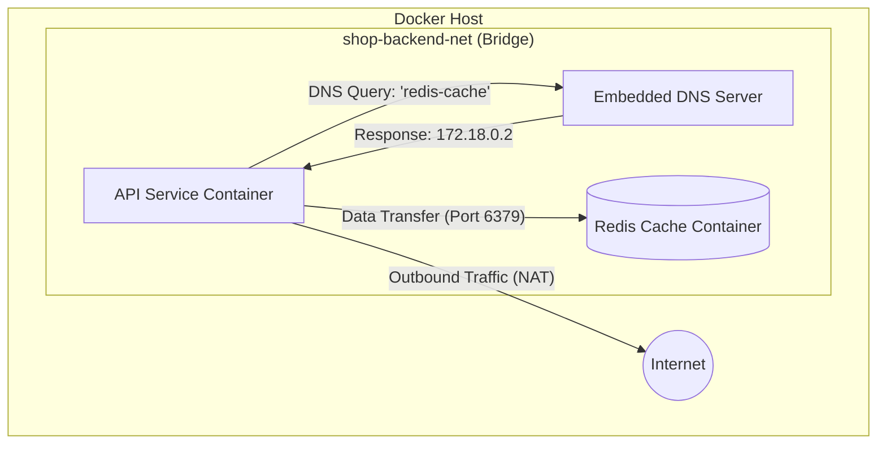

# Docker Networking и Volumes: работаем с данными и сетью

В мире контейнеризации Docker стал стандартом де-факто благодаря своей способности упаковывать приложения и их зависимости в переносимые единицы. Однако создание изолированного контейнера — это лишь половина дела. Для построения отказоустойчивых, масштабируемых и безопасных систем DevOps-инженеру необходимо понимать, как эти контейнеры взаимодействуют друг с другом, с внешней сетью и как они сохраняют свое состояние.

В этой статье мы глубоко погрузимся в два критически важных аспекта Docker: сетевое взаимодействие (Networking) и управление данными (Volumes/Mounts). Мы разберем, как Docker манипулирует сетевым стеком хоста, почему именованные тома предпочтительнее монтирования директорий для баз данных и как организовать многоуровневую изоляцию в Docker Compose.

---

## 1. Обзор сетевых драйверов: Как Docker изолирует ресурсы

Docker использует систему драйверов для реализации сетевого стека, что позволяет абстрагироваться от сложности настройки iptables, мостов и виртуальных интерфейсов на хост-системе. Понимание того, какой драйвер выбрать, напрямую влияет на производительность и безопасность вашего приложения.

### Драйвер Bridge (Мост)
Это стандартный драйвер Docker. При установке Docker на Linux автоматически создается сетевой интерфейс `docker0`. Каждый контейнер, подключаемый к bridge-сети, получает свой внутренний IP-адрес.

*   **Механизм:** Docker создает виртуальную пару интерфейсов (veth). Один конец остается в сетевом пространстве имен (namespace) контейнера, другой — привязывается к мосту на хосте.
*   **Особенности:** Контейнеры в одной bridge-сети могут общаться по IP. Однако автоматическое обнаружение имен (DNS) работает только в **пользовательских** (user-defined) сетях.
*   **Применение:** Идеально подходит для приложений, работающих на одном узле (standalone containers).

### Драйвер Host
С этим драйвером контейнер разделяет сетевое пространство имен с хостом.

*   **Механизм:** Контейнер не получает собственного IP. Если ваше приложение слушает порт 8080, оно делает это непосредственно на интерфейсе хост-машины.
*   **Преимущества:** Максимальная производительность, так как отсутствует оверхед на NAT (Network Address Translation).
*   **Недостатки:** Риск конфликта портов и полная потеря сетевой изоляции.

### Драйвер Overlay
Позволяет создавать распределенную сеть между несколькими хостами Docker.

*   **Механизм:** Использует технологию VXLAN для инкапсуляции трафика. Для работы требуется режим Docker Swarm или использование внешнего хранилища (Consul/Etcd).
*   **Применение:** Микросервисные архитектуры, развернутые на кластере серверов.

### Драйвер Macvlan
Позволяет назначить контейнеру реальный MAC-адрес, делая его видимым в физической сети как отдельное устройство.

*   **Особенности:** Контейнер получает IP из подсети вашей физической локальной сети (LAN).
*   **Применение:** Legacy-приложения, которые ожидают прямого доступа к физической сети, или системы мониторинга трафика.

### Драйвер None
Полная сетевая изоляция. Контейнер имеет только интерфейс `lo` (loopback).

*   **Применение:** Высокозащищенные вычислительные задачи, не требующие связи с внешним миром (например, генерация секретов или обработка конфиденциальных данных).

---

## 2. Bridge-сети: Создание и DNS-резолвинг

Одной из самых частых ошибок новичков является использование стандартной сети `bridge`. Проблема в том, что в ней контейнеры не могут обращаться друг к другу по именам — только по IP-адресам, которые могут измениться после перезапуска.

### Пользовательские сети (User-defined bridges)
Создание собственной сети активирует встроенный DNS-сервер Docker. Это позволяет сервисам находить друг друга по именам контейнеров или алиасам.

#### Практический пример:
Предположим, нам нужно запустить связку из API и кэша Redis.

```bash
# 1. Создаем изолированную сеть
docker network create --driver bridge shop-backend-net

# 2. Запускаем Redis с именем 'redis-cache'
docker run -d --name redis-cache \
  --network shop-backend-net \
  redis:alpine

# 3. Запускаем API-контейнер в той же сети в интерактивном режиме
docker run -it --name api-service \
  --network shop-backend-net \
  alpine sh
```

**Важно:** После выполнения последней команды ваш терминал подключится к оболочке (shell) внутри контейнера `api-service`. Теперь вы находитесь "внутри" контейнера и можете вводить команды для него.

Чтобы проверить связь, выполните команду прямо в терминале контейнера:
```bash
ping -c 4 redis-cache
```
Docker автоматически разрешит имя `redis-cache` в актуальный IP-адрес контейнера.

**Как выйти:**
*   Чтобы остановить бесконечный пинг, нажмите `Ctrl+C`.
*   Чтобы выйти из контейнера и вернуться в терминал вашей ОС, введите `exit`. 
*   *Примечание:* после выхода контейнер `api-service` остановится, так как его основной процесс (shell) завершился.

### Схема взаимодействия компонентов



---

## 3. Углубленное управление и отладка сетей

DevOps-инженеру важно уметь "заглянуть под капот" запущенной сети и уметь управлять жизненным циклом сетевых ресурсов.

*   **Список сетей:** Команда `docker network ls` позволяет увидеть все существующие сети на хосте. Это полезно для поиска "мусорных" сетей, оставшихся после удаления контейнеров.
    ```bash
    docker network ls
    ```
    Вы увидите ID сети, её имя, используемый драйвер и область видимости (scope).
*   **Инспекция сети:** Команда `docker network inspect <network_name>` — ваш главный инструмент. Она показывает подсеть (Subnet), шлюз (Gateway) и, что самое важное, список всех подключенных контейнеров с их IP и MAC адресами. Это критически важно при отладке проблем со связью.
*   **Динамическое управление:** Вы можете подключать работающий контейнер к новой сети без его остановки:
    ```bash
    docker network connect public-net my-container
    ```
    Это позволяет контейнеру находиться в нескольких сетях одновременно (например, в приватной сети с БД и публичной сети с Nginx).
*   **Удаление сетей:** Если сеть больше не нужна, её следует удалить командой `docker network rm <network_name>`. Обратите внимание: вы не сможете удалить сеть, пока к ней подключен хотя бы один контейнер (даже остановленный).
    ```bash
    docker network rm shop-backend-net
    ```

---

## 4. Работа с данными: Volumes vs Bind Mounts

Контейнеры по своей природе эфемерны. Любые данные, записанные в файловую систему контейнера (Writable Layer), будут удалены вместе с ним при выполнении `docker rm`. Кроме того, запись в Writable Layer осуществляется через Storage Driver (например, overlay2), что добавляет накладные расходы из-за использования механизма copy-on-write. Это делает запись напрямую в слой контейнера медленнее, чем использование внешних механизмов монтирования.

Для сохранения состояния и обеспечения высокой производительности I/O используются три основных механизма монтирования:

### Сравнение типов хранилищ

| Характеристика | Named Volumes (Тома) | Bind Mounts (Монтирование) | tmpfs Mounts |
| :--- | :--- | :--- | :--- |
| **Место хранения** | Управляется Docker (`/var/lib/docker/volumes/`) | Любой путь на хост-системе | Оперативная память (RAM) |
| **Управление** | Через Docker CLI | Через ОС хоста | Удаляется при стопе |
| **Переносимость** | Высокая | Низкая (зависит от путей хоста) | Нет |
| **Производительность** | Оптимальна для БД | Высокая на Linux, ниже на macOS/Win | Максимальная |

### Почему для баз данных выбирают Named Volumes?

1.  **Изоляция от хоста:** Вы не рискуете случайно удалить данные через файловый менеджер хоста.
2.  **Управление правами:** Docker сам устанавливает нужные права доступа (UID/GID) внутри тома. В случае с Bind Mount вы часто столкнетесь с тем, что Postgres или MySQL не могут завестись, так как у них нет прав на запись в папку хоста.
3.  **Оптимизация под ОС:** На Docker Desktop (Mac/Windows) именованные тома работают в разы быстрее, так как они находятся внутри виртуальной машины Docker, а не требуют проброса через медленную файловую систему хоста.

#### Пример использования Bind Mount для разработки:
Для прокидывания текущей директории в контейнер используйте следующую команду в зависимости от вашей ОС:

**Linux/macOS (Bash/Zsh):**
```bash
docker run -d --name web-dev -v "$(pwd)":/usr/share/nginx/html:ro -p 8080:80 nginx:alpine
```

**Windows (PowerShell):**
```powershell
docker run -d --name web-dev -v "${PWD}":/usr/share/nginx/html:ro -p 8080:80 nginx:alpine
```

**Windows (CMD):**
```cmd
docker run -d --name web-dev -v %cd%:/usr/share/nginx/html:ro -p 8080:80 nginx:alpine
```

*Примечание:* В этом примере мы монтируем текущую папку как статический контент для Nginx. Если папка пуста, при переходе на `localhost:8080` вы увидите ошибку 403 (так как индексного файла нет), но сам контейнер не упадет.

#### Пример использования Volume для продакшена:
```bash
# Создаем том для Postgres
docker volume create pg_data_prod

# Инспектируем том (полезно узнать путь хранения на хосте)
docker volume inspect pg_data_prod

# Запускаем базу данных
docker run -d -v pg_data_prod:/var/lib/postgresql/data postgres:15
```
Команда `docker volume inspect` особенно полезна, когда вам нужно найти реальный путь к данным на диске или проверить параметры тома (например, если он создан с использованием специального драйвера для сетевых хранилищ).

### Монтирование в оперативную память (tmpfs Mounts)

Иногда данные не нужно сохранять на диске, а, наоборот, нужно обеспечить максимальную скорость доступа или безопасность. Для этого Docker предоставляет `tmpfs`.

*   **Как это работает:** Данные записываются не в файловую систему хоста или контейнера, а непосредственно в оперативную память (RAM).
*   **Особенности:** Как только контейнер останавливается, данные в `tmpfs` бесследно исчезают.

#### Практический пример:
```bash
docker run -d --name secure-cache \
  --tmpfs /app/cache:rw,size=512m,mode=1777 \
  nginx:alpine
```
В данном примере мы создаем временное хранилище в оперативной памяти объемом 512 МБ по пути `/app/cache`.

**Когда использовать `tmpfs`?**
1.  **Безопасность:** Если ваше приложение работает с секретными данными (ключи, токены), которые не должны попасть на диск даже в зашифрованном виде.
2.  **Производительность:** Для высоконагруженных кэшей, где скорость записи на диск является "бутылочным горлышком".
3.  **Защита оборудования:** Для снижения износа SSD-накопителей при интенсивной записи временных файлов.

---

## 5. Изоляция и сетевые слои в Docker Compose

Docker Compose позволяет описывать сложную топологию сетей одной конфигурацией. Хорошей практикой считается разделение сервисов по уровням доступа (Tiers).

Рассмотрим пример `docker-compose.yml`, реализующий принцип **Defense in Depth**:

```yaml
version: '3.9'

services:
  reverse-proxy:
    image: nginx:alpine
    ports:
      - "80:80"
    networks:
      - frontend

  app-backend:
    image: nginx:alpine # Используем публичный образ для примера
    networks:
      - frontend
      - backend

  database:
    image: postgres:15-alpine
    volumes:
      - db_data:/var/lib/postgresql/data
    networks:
      - backend
    environment:
      POSTGRES_PASSWORD_FILE: /run/secrets/db_password
    secrets:
      - db_password

secrets:
  db_password:
    # Важно: создайте файл db_password.txt с паролем в этой же папке
    file: ./db_password.txt

networks:
  frontend: # Сеть для внешнего трафика
  backend:  # Изолированная сеть для данных

volumes:
  db_data:
```

**Анализ архитектуры:**
1.  `reverse-proxy` имеет доступ только к сети `frontend`. Он может общаться с `app-backend` по имени сервиса (DNS), но "не видит" базу данных.
2.  `database` находится в сети `backend`. У нее нет прямого доступа в интернет, и к ней нельзя подключиться извне.
3.  Если `reverse-proxy` будет скомпрометирован, злоумышленник не сможет напрямую атаковать базу данных, так как они находятся в разных сетевых сегментах.
4.  **Безопасность данных:** Использование `POSTGRES_PASSWORD_FILE` с механизмом `secrets` позволяет не хранить пароли в открытом виде в переменных окружения (которые можно увидеть через `docker inspect`).

*Примечание:* Перед запуском `docker-compose up` не забудьте создать текстовый файл `db_password.txt` и вписать туда желаемый пароль для базы данных.

---

## 6. Гигиена системы: Очистка и управление

Накопление неиспользуемых данных — "тихий убийца" Docker-хостов.

*   **Очистка томов:** `docker volume prune` удалит все тома, которые не используются ни одним запущенным или остановленным контейнером. Будьте осторожны: если вы временно удалили контейнер с БД, `prune` сотрет ваши данные.
*   **Комплексная очистка:** `docker system prune -a --volumes` — **самый радикальный и потенциально "опасный" способ.** Он удаляет абсолютно всё: все образы (включая кешированные, что замедлит следующую сборку), все сети, все контейнеры и все тома. Используйте его только если понимаете, что все важные данные уже сохранены где-то еще.
*   **Мониторинг места:** Используйте `docker system df` для оценки того, сколько места занимают различные типы объектов Docker. Команда `docker system df -v` покажет детализацию по каждому объекту, что поможет найти конкретный огромный том или образ.

### Стратегия бэкапа данных из Volumes
Поскольку тома управляются Docker, новички часто не знают, как делать их бэкап. Самый простой способ — запустить временный контейнер, который упакует данные в архив:
```bash
docker run --rm -v pg_data_prod:/data -v $(pwd):/backup alpine tar cvf /backup/backup.tar /data
```
Эта команда монтирует том `pg_data_prod`, архивирует его содержимое и сохраняет результат в текущую папку на хосте.

---

## 7. Шпаргалка по командам жизненного цикла (Cheat Sheet)

Для быстрого ориентирования в терминале держите под рукой этот список основных команд:

### Сетевое взаимодействие
| Команда | Описание |
| :--- | :--- |
| `docker network ls` | Показать все сети на хосте |
| `docker network create -d bridge <name>` | Создать новую bridge-сеть |
| `docker network inspect <name>` | Увидеть IP-адреса контейнеров в сети |
| `docker network connect <net> <cont>` | Подключить работающий контейнер к сети |
| `docker network disconnect <net> <cont>` | Отключить контейнер от сети |
| `docker network rm <name>` | Удалить сеть (если к ней нет подключений) |

### Хранение данных
| Команда | Описание |
| :--- | :--- |
| `docker volume ls` | Список всех именованных томов |
| `docker volume create <name>` | Создать новый том вручную |
| `docker volume inspect <name>` | Посмотреть детали тома (путь на диске) |
| `docker volume rm <name>` | Удалить неиспользуемый том |
| `docker volume prune` | Очистить все неиспользуемые тома |

---

## 8. Антипаттерны: Чего следует избегать

### Использование `--network host` без веской причины
Это часто делают, чтобы "решить проблемы с подключением". На самом деле это создает дыру в безопасности и лишает вас возможности запускать несколько копий одного приложения на одном порту. Используйте `host` только для системных инструментов (например, Node Exporter для Prometheus).

### Хранение баз данных в Bind Mounts на сетевых дисках (NFS/SMB)
Базы данных крайне чувствительны к задержкам и блокировкам файлов. Использование сетевых монтирований для `data`-директорий БД почти гарантированно приведет к повреждению данных (corruption) под нагрузкой. Для таких случаев используйте специализированные Volume Drivers.

### Использование одной сети для всех сервисов
В больших проектах это превращает вашу инфраструктуру в "плоскую сеть", где любой взломанный микросервис открывает путь ко всей системе. Всегда сегментируйте трафик.

---

## Заключение

Мастерство работы с сетями и данными в Docker отличает "просто пользователя" от профессионального DevOps-инженера. Помните три ключевых правила:
1.  **DNS превыше IP:** Всегда создавайте свои сети для надежного обнаружения сервисов.
2.  **Volumes для состояния:** Храните важные данные в именованных томах, а конфиги — в Bind Mounts или Docker Secrets.
3.  **Изоляция — это стандарт:** Используйте Docker Compose для создания многоуровневых защищенных сетей.

Понимая эти механизмы, вы сможете строить системы, которые не только легко масштабируются, но и остаются безопасными и предсказуемыми в эксплуатации. Следующим шагом в изучении сетевого взаимодействия может стать погружение в Service Mesh и сетевые плагины Kubernetes (CNI), но фундамент закладывается именно здесь — в Docker Networking.

---

## 9. FAQ: Ответы на частые вопросы новичков

**Q: Если я использую `docker network connect`, получит ли контейнер второй IP-адрес?**
A: Да. Каждое подключение к новой сети добавляет контейнеру новый виртуальный сетевой интерфейс с IP-адресом из подсети этой сети. Таким образом, контейнер может быть "мостом" между разными изолированными сегментами.

**Q: Как `reverse-proxy` узнает IP-адрес `app-backend` в Docker Compose, если я его не указываю?**
A: В Docker Compose по умолчанию все сервисы объединяются в общую сеть. Встроенный DNS-сервер Docker автоматически сопоставляет имена сервисов (например, `app-backend`) с их текущими IP-адресами. Вам достаточно просто использовать имя сервиса в конфигурации (например, `proxy_pass http://app-backend;`).

**Q: Можно ли одновременно использовать и Volume, и Bind Mount для одного контейнера?**
A: Конечно. Обычная практика — монтировать конфигурационный файл через Bind Mount (чтобы удобно править его на хосте) и хранить рабочие данные базы в Named Volume (для производительности и изоляции).
