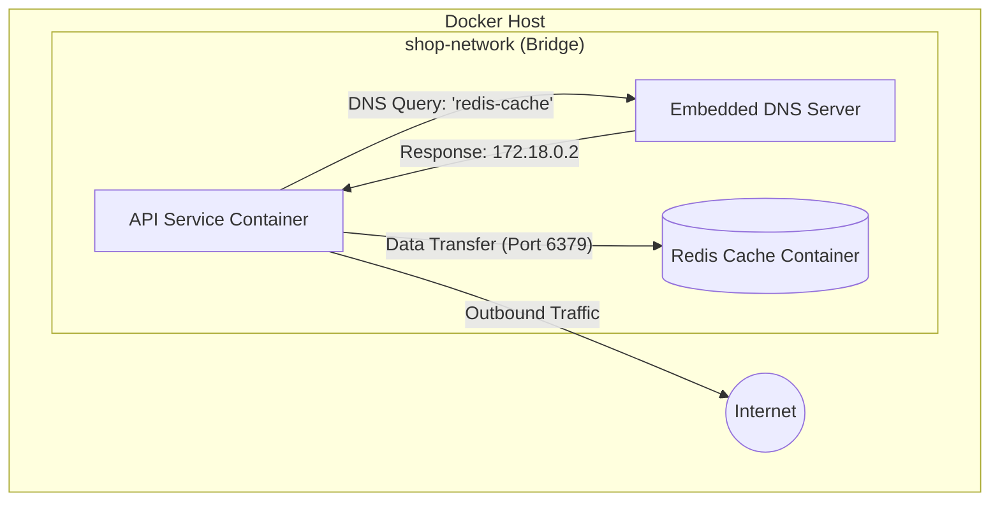

# Docker Networking и Volumes: Deep Dive — работаем с данными и сетью

В Docker контейнеры по умолчанию изолированы друг от друга и от хост-системы. Однако для создания реальных приложений нам нужно, чтобы сервисы могли общаться между собой, сохранять состояние базы данных после перезапуска и иметь доступ к конфигурационным файлам. В этом уроке мы глубоко погрузимся в механизмы сетевого взаимодействия и управления данными в Docker.

---

## Как Docker изолирует сети — обзор драйверов

Docker использует систему драйверов для реализации сетевого стека. Это позволяет гибко настраивать окружение в зависимости от задач: от простой изоляции на одном узле до сложных распределенных сетей в облаке.

### 1. bridge (мост)
Это драйвер по умолчанию. При установке Docker создает сеть `bridge` (интерфейс `docker0` в Linux). 
*   **Как это работает:** Контейнеры, подключенные к одной bridge-сети, могут общаться по IP-адресам. Если используется пользовательская (custom) сеть, включается автоматический DNS-резолвинг.
*   **Когда использовать:** Для большинства стандартных приложений, работающих на одном сервере.

### 2. host
Убирает сетевую изоляцию. Контейнер не получает собственного IP-адреса в виртуальной сети Docker.
*   **Как это работает:** Если приложение в контейнере слушает 80-й порт, оно фактически слушает его на реальном интерфейсе хоста.
*   **Когда использовать:** Для приложений, требующих максимальной производительности сети (без оверхеда на NAT), или когда нужно работать с большим диапазоном портов.

### 3. overlay
Позволяет соединять контейнеры на разных физических хостах.
*   **Как это работает:** Создает виртуальную сеть поверх существующих сетей хостов. Требует включенного режима Docker Swarm или внешнего хранилища ключей-значений (key-value store).
*   **Когда использовать:** В кластерах, микросервисной архитектуре, распределенной по нескольким серверам.

### 4. macvlan
Назначает контейнеру реальный MAC-адрес.
*   **Как это работает:** Контейнер выглядит для роутера как отдельное физическое устройство в сети.
*   **Когда использовать:** Для мониторинга сетевого трафика или legacy-приложений, которые должны иметь "честный" IP в локальной сети компании.

### 5. none
Контейнер создается только с интерфейсом `loopback`.
*   **Когда использовать:** Для выполнения вычислений, не требующих доступа к сети (например, пакетная обработка данных, генерация PDF), что максимально повышает безопасность.

---

## Bridge network: Создание и DNS-резолвинг

Хотя стандартная сеть `bridge` всегда доступна, в ней **нет** встроенного DNS-резолвинга по именам контейнеров. Для нормальной работы микросервисов нужно создавать свои сети.

### Практический пример

```bash
# Создаем изолированную сеть для проекта "shop"
docker network create --driver bridge shop-network

# Запускаем Redis. Имя контейнера будет служить DNS-именем.
docker run -d --name redis-cache --network shop-network redis:alpine

# Запускаем приложение
docker run -it --name api-service --network shop-network alpine sh
```

Внутри `api-service` вы можете выполнить `ping redis-cache`, и Docker успешно разрешит это имя в IP-адрес.

### Схема взаимодействия



---

## Углубленное управление сетями

Для диагностики и управления используйте следующие команды:

*   `docker network ls`: Показывает список всех сетей. Обратите внимание на колонку SCOPE (local или swarm).
*   `docker network inspect <name>`: Самая важная команда для отладки. Показывает подсеть (Subnet), шлюз (Gateway) и список всех подключенных контейнеров с их IP-адресами.
*   `docker network connect/disconnect`: Позволяет на лету подключать или отключать работающий контейнер от сети. Это полезно, если контейнеру нужно временно получить доступ к другому сегменту сети.

---

## Работа с данными: Volumes и Bind Mounts

Данные внутри контейнера живут столько же, сколько сам контейнер. Чтобы база данных не обнулилась после `docker stop`, мы используем тома.

### Типы хранилищ в Docker

| Тип | Где хранятся данные? | Лучший сценарий (Use Case) |
| :--- | :--- | :--- |
| **Named Volume** | Внутренняя область Docker (`/var/lib/docker/volumes`) | Базы данных (PostgreSQL, MySQL) в продакшене. |
| **Bind Mount** | Конкретная папка на диске хоста (например, `/opt/app/config`) | Редактирование кода "на лету" при разработке или проброс конфигов. |
| **tmpfs** | В оперативной памяти | Секретные ключи, временные кэши, которые не должны попасть на диск. |

### Почему Named Volume лучше Bind Mount для БД?
1.  **Производительность:** На macOS и Windows Named Volumes работают значительно быстрее.
2.  **Управление:** Docker сам следит за правами доступа (permissions). В Bind Mount часто возникают ошибки, когда контейнер не может писать в папку, созданную пользователем `root` на хосте.
3.  **Изоляция:** Вы не можете случайно удалить данные из Named Volume через проводник или файловый менеджер хоста.

---

## Изоляция сетей в Docker Compose

В реальных проектах мы разделяем сети на "слои" (tiers). Например, база данных никогда не должна быть доступна из внешней сети.

```yaml
version: '3.9'

services:
  nginx-proxy:
    image: nginx:alpine
    ports:
      - "80:80"
    networks:
      - public

  backend-api:
    build: ./api
    networks:
      - public
      - private

  postgres-db:
    image: postgres:15-alpine
    environment:
      POSTGRES_PASSWORD: secret_pass
    volumes:
      - pgdata:/var/lib/postgresql/data
    networks:
      - private

networks:
  public:  # Доступна для прокси
  private: # Изолированная сеть для данных

volumes:
  pgdata:
```

**Результат:** `nginx-proxy` может "общаться" с `backend-api`, но не имеет технической возможности достучаться до `postgres-db`. Это стандарт безопасности Defense in Depth.

---

## Очистка системы (Cleanup)

Забытые тома — главная причина, по которой на Docker-хостах заканчивается место.

*   `docker volume ls`: Список томов.
*   `docker volume prune`: Удаляет все тома, которые не подключены ни к одному **существующему** контейнеру. 
    *   *Внимание:* Если вы удалили контейнер с БД, но планировали создать его заново — `prune` удалит ваши данные!
*   `docker system prune -a --volumes`: Тотальная очистка всего неиспользуемого (образы, сети, контейнеры, тома).

---

## Антипаттерны (Как делать НЕ надо)

### 1. Злоупотребление `--network host`
Использование хостовой сети лишает вас преимуществ Docker: вы можете столкнуться с конфликтами портов, а безопасность контейнера сводится к минимуму. Используйте это только в крайних случаях (например, для системного мониторинга хоста).

### 2. БД на Bind Mount без понимания прав
Если вы монтируете `-v /my/data:/var/lib/mysql`, убедитесь, что у пользователя, под которым работает MySQL внутри контейнера, есть права на запись в `/my/data` на хосте. Часто это становится причиной "таинственных" падений БД при старте.

### 3. "Одна большая сеть"
Не подключайте все 20 микросервисов к одной сети `default`. Разделяйте их по бизнес-логике или уровню доступа. Если один сервис будет взломан, злоумышленнику будет сложнее просканировать остальные части системы.

---

## Итоги урока
1.  **Сети:** Всегда создавайте `custom bridge` для автоматического DNS.
2.  **Данные:** Используйте `Named Volumes` для данных и `Bind Mounts` для конфигураций.
3.  **Безопасность:** Изолируйте чувствительные сервисы (БД, очереди сообщений) в приватных сетях Compose.
