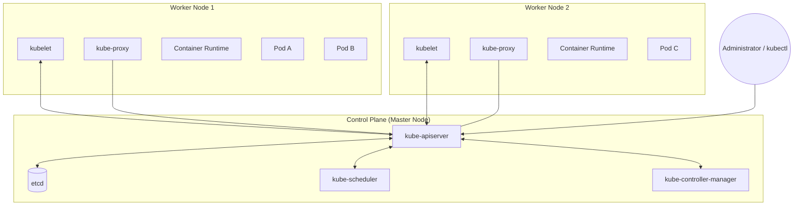

# Kubernetes с нуля: путь к промышленной оркестрации

Добро пожаловать в мир промышленной оркестрации! Если вы читаете эту статью, значит, вы уже переросли уровень простого запуска одиночных контейнеров через `docker run` и, скорее всего, успели оценить удобство Docker Compose для локальной разработки. Но мир продакшена диктует свои суровые правила: приложения должны быть отказоустойчивыми, масштабируемыми и обновляться без простоев (zero-downtime). Именно здесь на сцену выходит Kubernetes.

Kubernetes (или K8s) — это не просто инструмент, это целая экосистема, которая за последние годы стала стандартом де-факто для облачных вычислений. В этой статье мы подробно разберем архитектуру K8s, научимся разворачивать локальный кластер и поймем, почему версия 1.28+ считается одной из самых стабильных и функциональных на текущий момент.

## История и контекст: почему K8s победил в «войне оркестраторов»?

В начале 2010-х годов, когда Docker взорвал мир IT своей концепцией контейнеризации, сразу возник вопрос: а как управлять тысячами таких контейнеров? На рынке появилось несколько игроков: Docker Swarm (простой, но ограниченный), Apache Mesos (мощный, но крайне сложный) и Kubernetes, рожденный внутри Google на основе их внутреннего проекта Borg.

Kubernetes победил благодаря своей гибкости, мощному API и огромному сообществу. В отличие от Swarm, который пытался просто «расширить» Docker на несколько машин, K8s предложил абсолютно новую парадигму: **декларативное управление состоянием**. Вы не говорите кластеру «запусти этот контейнер», вы говорите «я хочу, чтобы в моем кластере всегда работало 3 копии этого приложения», и Kubernetes берет на себя всю работу по достижению и поддержанию этого состояния.

Сегодня Kubernetes 1.28+ — это зрелая платформа. С каждым новым релизом она становится всё более стабильной, избавляясь от старых костылей и внедряя нативную поддержку современных паттернов, таких как sidecar-контейнеры.

## Декларативный подход: Философия Kubernetes

Одно из главных отличий K8s от Docker Compose — это переход от императивного стиля к декларативному.

*   **Императивный стиль (Как делать)**: «Docker, запусти контейнер с образом nginx, пробрось 80-й порт и назови его web».
*   **Декларативный стиль (Что получить)**: «Kubernetes, я хочу, чтобы в системе существовал объект Deployment, который поддерживает 3 реплики nginx. Мне всё равно, как ты это сделаешь, на каких нодах запустишь и как будешь перезапускать при сбоях. Просто обеспечь этот результат».

Этот подход позволяет использовать GitOps — когда вся ваша инфраструктура описана в коде (YAML), и любая правка в Git автоматически приводит к изменениям в реальном кластере.

## Проблема Docker Compose в production: почему нам нужно нечто большее?

Docker Compose — великолепный инструмент. Он позволяет описать весь стек приложения (базу, бэкенд, фронтенд) в одном YAML-файле и запустить его одной командой. Для разработчика на локальной машине это идеал. Но когда мы переносим этот подход в «боевую» среду, мы сталкиваемся с фундаментальными проблемами.

### Сравнительная таблица: Docker Compose vs Kubernetes

| Характеристика | Docker Compose | Kubernetes |
|----------------|----------------|------------|
| **Масштабируемость** | Только вертикальная (один узел) | Горизонтальная (сотни и тысячи узлов) |
| **Отказоустойчивость**| Зависит от жизни одного сервера | Автоматический перенос подов при падении узла |
| **Service Discovery** | Внутренняя сеть Docker (одна машина) | Встроенный DNS, Service, Ingress |
| **Управление конфигурациями** | Переменные окружения и монтирование файлов | ConfigMaps и Secrets (динамическое обновление) |
| **Обновления** | Обычно с простоем (stop/start) | Rolling Updates, Blue/Green, Canary |
| **Bin Packing** | Отсутствует (контейнеры запускаются «вручную») | Автоматическое распределение по свободным ресурсам |
| **Мониторинг** | Внешние инструменты (Prometheus/Grafana) | Встроенные метрики + нативная интеграция |

### 1. Ограничение одного узла (Single Node Limitation)
Docker Compose работает в рамках одного Docker Engine. Это означает, что все ваши сервисы привязаны к одной физической или виртуальной машине. Если ваше приложение становится популярным и начинает потреблять больше ресурсов, чем может предоставить один сервер, у вас остается только путь «вертикального масштабирования» — покупки более дорогого и мощного «железа». Kubernetes же позволяет выполнять «горизонтальное масштабирование», объединяя сотни серверов в единый вычислительный пул.

### 2. Отсутствие интеллектуального планирования (Scheduling)
В Docker Compose вы сами решаете, где запустить контейнер. В Kubernetes за это отвечает **Scheduler**. Он знает о свободных ресурсах на каждой ноде, о требованиях вашего приложения и о правилах близости (affinity/anti-affinity). Например, K8s никогда не положит две копии критически важного сервиса на один и тот же сервер, если у него есть выбор, чтобы минимизировать риски при аварии.

### 3. Самовосстановление (Self-healing) и "Bin Packing"
Bin Packing — это алгоритм, который позволяет максимально плотно «упаковывать» контейнеры на серверы, чтобы вы не платили за простаивающие мощности. Kubernetes делает это автоматически. Что касается самовосстановления, то K8s использует Liveness и Readiness пробы. Если приложение перестает отвечать на специфические запросы, K8s убивает «заболевший» контейнер и создает новый на исправном узле.

## Архитектура Kubernetes: как устроена магия?

Прежде чем вводить команды в терминале, нужно понять, как K8s устроен «под капотом». Кластер Kubernetes состоит из двух основных частей: **Control Plane** (Управляющий слой) и **Worker Nodes** (Рабочие узлы).

### Визуальная схема архитектуры



### Глубокое погружение в компоненты Control Plane

1.  **kube-apiserver**: Центральный узел управления. Это RESTful API, который превращает ваши YAML-файлы в инструкции для кластера. Единственный компонент, имеющий доступ к `etcd`. Все остальные части кластера «подписаны» на изменения через API-сервер.

2.  **etcd**: Мозг и память кластера.
    *   **Алгоритм Raft**: Это сердце распределенной системы. В Raft узлы могут находиться в трех состояниях: Leader, Follower или Candidate. 
        *   **Выборы лидера**: Если фолловеры не получают сигналов от лидера, они переходят в состояние кандидата и инициируют выборы. 
        *   **Репликация логов**: Лидер принимает запросы на запись, сохраняет их в свой лог и рассылает фолловерам. Только после того, как большинство (кворум) подтвердит запись, она считается совершенной (`committed`).
    *   **Важность**: В `etcd` нельзя хранить медиафайлы или логи приложений. Это хранилище только для метаданных кластера. Любая команда `kubectl get pods` — это на самом деле запрос к API-серверу, который идет в `etcd`.

3.  **kube-scheduler**: Интеллектуальный распределитель.
    *   **Filtering (ранее Predicates)**: Отсеивает ноды, которые физически не могут запустить под. Например, если поду нужно 4 ГБ ОЗУ, а на ноде осталось 2 ГБ, нода фильтруется.
    *   **Scoring (ранее Priorities)**: Оценивает подходящие ноды по десятибалльной шкале. Учитываются такие факторы, как: равномерность распределения нагрузки, наличие нужных образов на ноде (чтобы не качать их заново) и правила `PodAffinity`.
    *   **Custom Schedulers**: Kubernetes позволяет запускать несколько планировщиков одновременно. Если вам нужен специфический алгоритм для ваших задач, вы можете написать свой планировщик.

4.  **kube-controller-manager**: Набор «контрольных петель». Это «дирижер», который следит за тем, чтобы текущее состояние кластера соответствовало желаемому.
    *   **Deployment Controller**: Следит за тем, чтобы количество запущенных подов соответствовало числу `replicas` в вашем манифесте.
    *   **StatefulSet Controller**: Обеспечивает порядок и уникальность для приложений с состоянием (БД).
    *   **HPA Controller (Horizontal Pod Autoscaler)**: Автоматически увеличивает количество подов, если нагрузка (CPU/RAM) растет.
    *   **Node Controller**: Проверяет состояние узлов каждые 5 секунд. Если узел недоступен более 40 секунд, он помечается как `NotReady`.
    *   **Job Controller**: Отвечает за запуск кратковременных задач (Jobs). Он следит за тем, чтобы задача была выполнена успешно хотя бы один раз (или заданное количество раз) и завершена.
    *   **Token Controller**: Автоматически создает токены доступа (Secret) для новых Service Accounts, позволяя подам безопасно взаимодействовать с API-сервером.
    *   **Service Account Controller**: Создает дефолтные Service Accounts для новых неймспейсов.

### Глубокое погружение в компоненты Worker Nodes

1.  **kubelet**: Самый важный агент на рабочей машине.
    *   Он работает напрямую со средой выполнения контейнеров.
    *   **PLEG (Pod Lifecycle Event Generator)**: Это механизм внутри kubelet, который считывает события от Container Runtime и формирует общую картину состояния подов. PLEG позволяет kubelet не опрашивать рантайм постоянно («есть ли изменения?»), а эффективно реагировать на изменения статуса контейнеров, экономя ресурсы CPU.
    *   **cAdvisor**: Внутри kubelet работает компонент cAdvisor, который собирает статистику использования ресурсов (CPU, память, сеть, диск) каждым контейнером на этой ноде. Эти данные затем используются планировщиком и HPA.
    *   Если вы вручную удалите контейнер через `docker rm` на ноде, `kubelet` тут же это заметит и запустит его снова.

2.  **kube-proxy**: Мастер сетевых правил.
    *   **Режим IPTables**: Работает через цепочки правил NAT. При большом количестве сервисов (более 2000-5000) производительность падает, так как поиск в таблице идет линейно.
    *   **Режим IPVS**: Использует хэш-таблицы в ядре Linux. Это обеспечивает практически мгновенный поиск (O(1)) вне зависимости от количества сервисов. Также IPVS поддерживает сложные алгоритмы балансировки, такие как «Weighted Round Robin» или «Least Connection».

3.  **Интерфейсы (CRI, CNI, CSI)**:
    Kubernetes спроектирован как модульная система. Это означает, что вы можете «вынуть» одну часть и заменить её другой, если она соответствует стандарту интерфейса. Это делает K8s независимым от конкретных вендоров облаков или технологий хранения данных.

    *   **CRI (Container Runtime Interface)**: Это стандарт того, как Kubernetes общается со средой выполнения контейнеров.
        *   **История с Dockershim**: Раньше K8s содержал встроенную поддержку Docker (так называемый dockershim). Однако с версии 1.24 эта поддержка была удалена в пользу более легких и производительных решений.
        *   **containerd**: Это стандартный промышленный рантайм, который используется в большинстве современных инсталляций (включая Google GKE и Azure AKS). Он быстрее и потребляет меньше памяти, чем полноценный Docker.
        *   **CRI-O**: Ещё одна альтернатива CRI, созданная специально для Kubernetes с упором на безопасность и минималистичность.

    *   **CNI (Container Network Interface)**: Позволяет выбирать сетевой плагин. Каждый облачный провайдер или вендор сетевых решений предоставляет свой CNI-плагин. Популярные примеры:
        *   **Calico**: Поддерживает продвинутые сетевые политики (Network Policies).
        *   **Flannel**: Самый простой в настройке, использует VXLAN.
        *   **Cilium**: Основан на технологии eBPF, обеспечивает высочайшую производительность и безопасность.

    *   **CSI (Container Storage Interface)**: Позволяет подключать любые хранилища. Раньше код для работы с AWS или Google Cloud был «зашит» в ядро Kubernetes (in-tree), что замедляло выпуск обновлений. С появлением CSI драйверы пишутся и обновляются независимо от самого K8s. Теперь вы можете подключить что угодно: от локальных дисков до Ceph, GlusterFS или облачных блочных хранилищ (AWS EBS, Google Persistent Disk).

## Глубокое погружение в сеть Kubernetes

Сетевая модель Kubernetes — это одна из самых сложных и одновременно элегантных частей системы. Она базируется на нескольких фундаментальных правилах:
1.  **Каждый Под получает свой уникальный IP-адрес** в рамках кластера.
2.  **Любой Под может общаться с любым другим Подом** на любой ноде напрямую, без использования NAT.
3.  **Агенты на ноде (например, kubelet)** могут общаться со всеми подами на этой же ноде.

### Pod-to-Pod Communication
Когда Pod A хочет отправить пакет Pod B, он просто использует IP-адрес Pod B. Сетевой плагин (CNI) гарантирует, что пакет дойдет до цели, даже если поды находятся на разных физических серверах. Внутри одной ноды это обычно решается через виртуальный бридж (linux bridge) или veth-пары. Между нодами трафик может идти через туннелирование (VXLAN, Geneve) или прямую маршрутизацию (BGP в случае Calico).

### Pod-to-Service Communication
IP-адреса подов эфемерны — под может умереть, а новый получит другой адрес. Чтобы решить эту проблему, в K8s есть абстракция **Service**.
*   **ClusterIP**: Виртуальный стабильный IP-адрес. Когда вы обращаетесь к нему, `kube-proxy` перехватывает трафик и перенаправляет его на один из живых подов, стоящих за этим сервисом.
*   **Service Discovery**: Kubernetes автоматически создает DNS-запись для каждого сервиса. Это значит, что ваше приложение на Java может просто вызвать `http://my-database`, а K8s сам разберется, на какой IP отправить запрос.

## Установка локального окружения (K8s 1.28+)

Для обучения нам не нужно арендовать сотни серверов в облаке. Мы будем использовать **minikube** — инструмент, который упаковывает полноценный кластер Kubernetes в одну виртуальную машину или Docker-контейнер.

### Инструментарий для разных ОС

#### 1. Linux (Universal)
```bash
# Установка minikube
curl -LO https://storage.googleapis.com/minikube/releases/latest/minikube-linux-amd64
sudo install minikube-linux-amd64 /usr/local/bin/minikube

# Установка kubectl
curl -LO "https://dl.k8s.io/release/$(curl -L -s https://dl.k8s.io/release/stable.txt)/bin/linux/amd64/kubectl"
chmod +x kubectl
sudo mv kubectl /usr/local/bin/
```

#### 2. macOS (Homebrew)
Для пользователей Mac установка сводится к одной строке:
```bash
brew install minikube kubectl
```
*Совет: Если вы используете Apple Silicon (M1/M2/M3), драйвер `docker` работает отлично через Docker Desktop или Colima.*

#### 3. Windows (Winget или Chocolatey)
```powershell
# Через Winget (стандартно в Windows 10/11)
winget install minikube kubectl

# Или через Chocolatey
choco install minikube kubernetes-cli
```

### Запуск кластера и решение проблем

Запуск кластера:
```bash
minikube start --driver=docker --kubernetes-version=v1.28.0 --cpus=2 --memory=4g
```

**Первые шаги после запуска:**
Для визуализации и мониторинга состояния кластера minikube предоставляет удобные аддоны:
```bash
# Включение встроенной панели управления (откроется в браузере)
minikube dashboard

# Включение сервера метрик для работы команды `kubectl top`
minikube addons enable metrics-server
```

**Common Troubleshooting:**
*   **Virtualization error**: Убедитесь, что в BIOS включена поддержка виртуализации (VT-x/AMD-V).
*   **Docker not found**: Убедитесь, что Docker запущен и у вашего пользователя есть права на доступ к сокету (`sudo usermod -aG docker $USER`).
*   **Insufficient resources**: Если у вас мало RAM, попробуйте `--memory=2g`, но кластер будет работать медленнее.

## Поды (Pods): Фундамент Kubernetes

### Жизненный цикл Пода (Pod Lifecycle)
Стадии жизни пода критически важны для понимания того, что происходит с вашим приложением:
1.  **Pending**: К8s ищет ноду для пода и скачивает образы. Если под долго в этом статусе — проверьте `kubectl get events` (возможно, нет места на нодах).
2.  **Running**: Контейнеры созданы и хотя бы один запускается или уже работает.
3.  **Succeeded**: Под выполнил свою задачу (например, скрипт миграции базы) и завершился с кодом 0.
4.  **Failed**: Произошла ошибка (код отличный от 0). К8s может перезапустить контейнер в зависимости от `restartPolicy`.
5.  **Unknown**: Control Plane потерял связь с нодой, где живет под.

### Процесс удаления Пода (Termination)
Когда вы удаляете под, Kubernetes запускает процесс «мягкого завершения»:
1.  Под переходит в состояние `Terminating`.
2.  Контейнерам отправляется сигнал **SIGTERM**.
3.  Начинается отсчет `terminationGracePeriodSeconds` (по умолчанию 30 секунд). Ваше приложение должно успеть закрыть все соединения и сохранить данные.
4.  Если за это время контейнер не умер, отправляется **SIGKILL**.

### Продвинутые паттерны: Init-контейнеры и Sidecars

*   **Init Containers**: Запускаются **до** основных контейнеров. Идеально подходят для предварительной настройки: ожидания доступности базы данных, скачивания конфигов или генерации сертификатов. Основной контейнер не начнет работу, пока все Init-контейнеры не завершатся успешно.
*   **Sidecar Containers**: Работают **параллельно** с основным. 
    *   *Пример:* Основной контейнер — Nginx. Сайдкар — агент сбора логов.
    *   В Kubernetes 1.28+ появилась возможность помечать контейнеры как Sidecar (через `restartPolicy: Always` в initContainers), чтобы гарантировать их запуск до основного и корректное завершение после.

## Реальный сценарий: Что произойдет, если нода упадет?

Представьте, что ваше приложение работает на 3 нодах. Одна нода внезапно выключается.
1.  `kubelet` на упавшей ноде перестает слать «heartbeats» в `kube-apiserver`.
2.  `Node Controller` через 40 секунд помечает ноду как `NotReady`.
3.  `Deployment Controller` видит, что количество живых подов стало 2 вместо 3.
4.  Он запрашивает у `kube-scheduler` место для нового пода.
5.  `kube-scheduler` выбирает одну из оставшихся живых нод.
6.  `kubelet` на новой ноде скачивает образ и запускает под.
7.  Приложение снова работает в 3 экземплярах. Всё это происходит автоматически и без вашего участия!

## Практика: Ваш первый запуск

Давайте запустим Nginx и научимся управлять им как профи.

```bash
# Создаем под
kubectl run my-nginx --image=nginx:alpine

# Наблюдаем за процессом в реальном времени
kubectl get pods -w
```

## Распространенные ошибки Подов (Troubleshooting)

Даже опытные инженеры сталкиваются с тем, что их поды не запускаются. Вот «золотая четверка» ошибок и способы их диагностики:

### 1. ImagePullBackOff
**Что это:** Kubernetes не смог скачать образ контейнера.
*   **Причины:** Ошибка в названии образа, приватный репозиторий без прав доступа, или отсутствие тега.
*   **Как лечить:**
    ```bash
    kubectl describe pod <pod-name>
    ```
    В разделе `Events` вы увидите точную причину (например, `401 Unauthorized` или `manifest not found`).

### 2. CrashLoopBackOff
**Что это:** Контейнер запускается, но тут же падает. Kubernetes пытается его перезапустить снова и снова, увеличивая паузу между попытками.
*   **Причины:** Ошибка в коде приложения, отсутствие нужных переменных окружения, или нехватка прав на чтение конфига.
*   **Как лечить:**
    ```bash
    kubectl logs <pod-name> --previous
    ```
    Флаг `--previous` позволяет увидеть логи *предыдущего* (упавшего) экземпляра контейнера.

### 3. OOMKilled (Out of Memory)
**Что это:** Приложение потребило больше памяти, чем было разрешено в `limits`.
*   **Причины:** Утечка памяти в приложении или слишком жесткие лимиты в манифесте.
*   **Как лечить:**
    ```bash
    kubectl describe pod <pod-name>
    ```
    Ищите в статусе контейнера `Reason: OOMKilled`. Решение — оптимизировать код или увеличить `resources.limits.memory`.

### 4. Pending (Resource Pressure)
**Что это:** Под завис в состоянии ожидания и даже не начал создаваться.
*   **Причины:** В кластере недостаточно свободных ресурсов (CPU/RAM) или не удалось примонтировать хранилище (PV).
*   **Как лечить:**
    ```bash
    kubectl get events --sort-by='.lastTimestamp'
    ```
    Вы увидите сообщение от `default-scheduler`, объясняющее, почему ни одна нода не подошла для запуска пода.

### Команды для диагностики и отладки

*   **Describe**: `kubectl describe pod my-nginx` — покажет всё: от IP-адреса до истории событий.
*   **Logs**: `kubectl logs my-nginx -f` — стриминг логов.
*   **Exec**: `kubectl exec -it my-nginx -- sh` — проваливаемся внутрь контейнера.
*   **Events**: `kubectl get events --sort-by='.lastTimestamp'` — посмотреть последние события в кластере.
*   **Resources**: `kubectl top pod` (требуется metrics-server в minikube) — посмотреть потребление CPU и RAM подом.
*   **YAML Export**: `kubectl get pod my-nginx -o yaml` — посмотреть полную конфигурацию пода.

### Доступ к приложению

```bash
kubectl port-forward my-nginx 8080:80
```
Теперь `http://localhost:8080` откроет вам стандартную страницу Nginx.

## Namespaces: Порядок в большом кластере

Namespaces (пространства имен) позволяют избежать конфликтов имен. Вы можете иметь под с именем `api` в неймспейсе `dev` и другой под с тем же именем `api` в неймспейсе `prod`.

```bash
# Список неймспейсов
kubectl get ns

# Создание нового
kubectl create ns project-alpha

# Работа в контексте неймспейса
kubectl run redis --image=redis:alpine -n project-alpha
```

## Антипаттерны: Чего НЕ стоит делать в Kubernetes

1.  ❌ **Использование тега :latest**: Всегда указывайте конкретную версию образа.
2.  ❌ **Отсутствие Liveness/Readiness проб**: Без них К8s не знает, когда ваше приложение реально готово принимать трафик.
3.  ❌ **Запуск приложений от пользователя root**: Всегда старайтесь использовать `securityContext` для запуска от не-привилегированного пользователя.
4.  ❌ **Hardcoded IP addresses**: Используйте **Services** для обнаружения сервисов.

## Заключение

Мы прошли путь от понимания проблем Docker Compose до запуска первого пода в кластере Kubernetes 1.28. Теперь вы знаете, что `etcd` — это сердце кластера, работающее на алгоритме Raft, а `kube-apiserver` — его единственный интерфейс. Вы понимаете разницу между IPTables и IPVS и знаете, как `kubelet` управляет жизнью контейнеров через CRI.

Kubernetes — это огромный мир, и сегодня мы заложили его фундамент. Впереди нас ждут Deployments, Services, ConfigMaps и Ingress. Но уже сейчас у вас достаточно знаний, чтобы развернуть локальный кластер и начать эксперименты. Помните: в K8s лучше один раз увидеть `describe pod`, чем сто раз гадать, почему приложение не работает!

#kubernetes #k8s #devops #orchestration #cloudnative #docker
